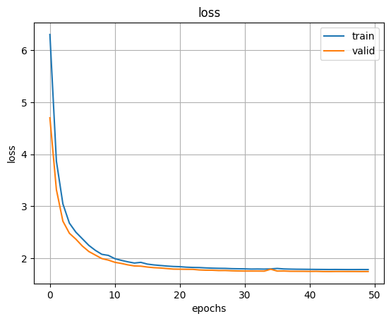
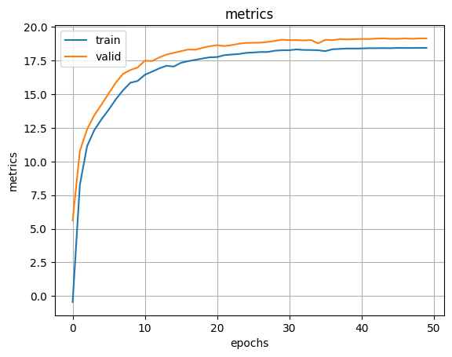

# BEAM

`Modules.py`:

    1.STFT
    2.MVDR

`model.py`:

    1. cuasal conv
    2. unet

`loss.py`:

    1. SpectralLoss
    2. MultiResSpecLoss
    3. PerceptualLoss - lpips магнитуды

`data.py` пока такой (кривой и не совсем правильный), будет лучше: 

    1. generate_mixture - генерация шума с определенный SNR
    2. collate_fn - батч из сэмплов разной длины. 
    3. my_dataset

`example_train_step.ipynb`: пример шага обучения

`model_ттх-check.ipynb`: характеристики модели (кол-во параметров, скорость)

`overfit_noise_polar.ipynb`: оверфит с шумом, torch.polar: не учится

`overfit_noise_complex.ipynb`: оверфит с шумом, torch.complex, обзор масок и магнитуд. А также тест с MVDR
ссылка для прослушки из overfit_noise_complex.ipynb: https://drive.google.com/drive/folders/1_TWca73rB_Wt--UEdYXsY2CulICIMwgG?usp=drive_link

`train_denoise&deverb.ipynb`: на срезаном train-clean-100 с шумом + 10% RIR

`train_denosie_libree.ipynb`: модель обучена на LIBRISPEECH train-clean-100 
и проверена на test-clean

Ссылка на треки: https://drive.google.com/drive/folders/1itJ3aUEX_zQuEz6NdrUCRwSPXiS-vcMI

