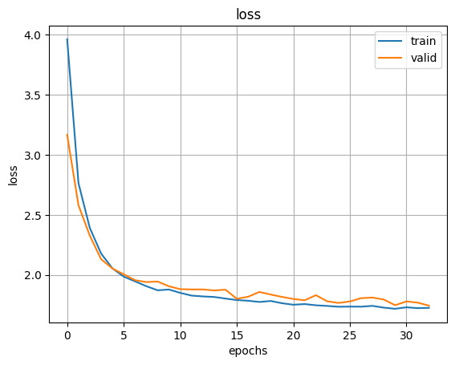
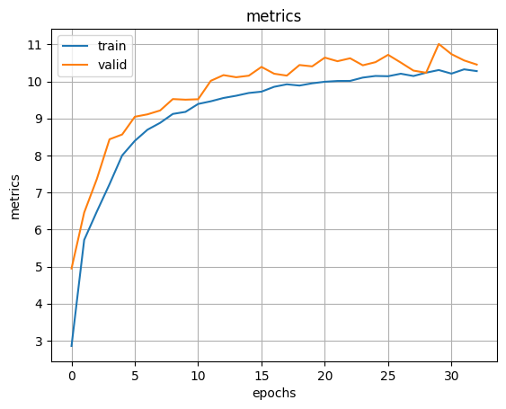
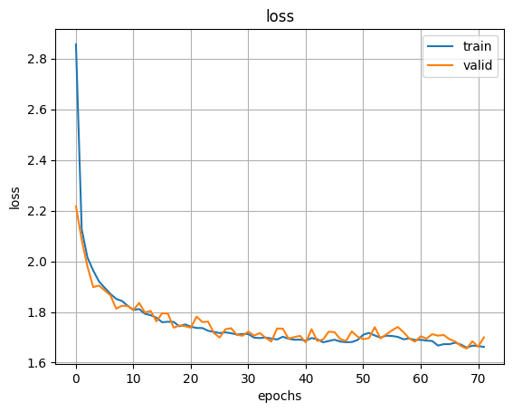
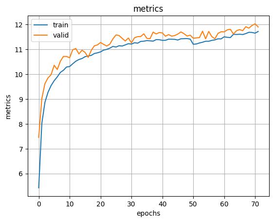

# V6
Всё точно так же как в [`v5`](../v5), кроме датасета.
Dataset:

train - `LIBRISPEECH train-clean-100` с шумом `Deman` и `Musan`

valid - `LIBRISPEECH test-clean` с шумом `Deman` и `Musan`

`data.py`: кропаем случайный сегмент, далее добавлем шум из `Deman` или из `Musan`.

`mse & res`: checkpoint и log файлы.

К модели с вероятностью добавляется шум из `Deman` или из `Musan`

1) модель 1 обучена (стопнута по лоссу):

    а) MSE wave + MultiResSpecLoss(n_ffts=[400, 1024], f_complex=100, factor=100, gamma=0.3) 
    
    б) sec = 1, batch = 256, snr = random.randint(0, 10)

ссылка на треки https://drive.google.com/drive/folders/1zMQ1DF3Pg00leosOOMzVpskkYl6F-yqW?usp=sharing

    

        
        
    

2) модель 2 обучена:

    а) MultiResSpecLoss(n_ffts=[400, 256], f_complex=100, factor=100, gamma=0.3) 
    
    б) sec = 3, batch = 32, snr = random.randint(0, 5)

ссылка на треки https://drive.google.com/drive/folders/1Ln4DCs8YKguKpG32RQhdoBm9Gh0j3Mnx?usp=drive_link

    

        
        
    

